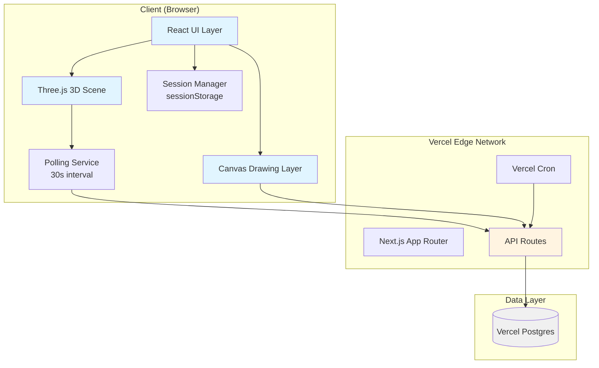
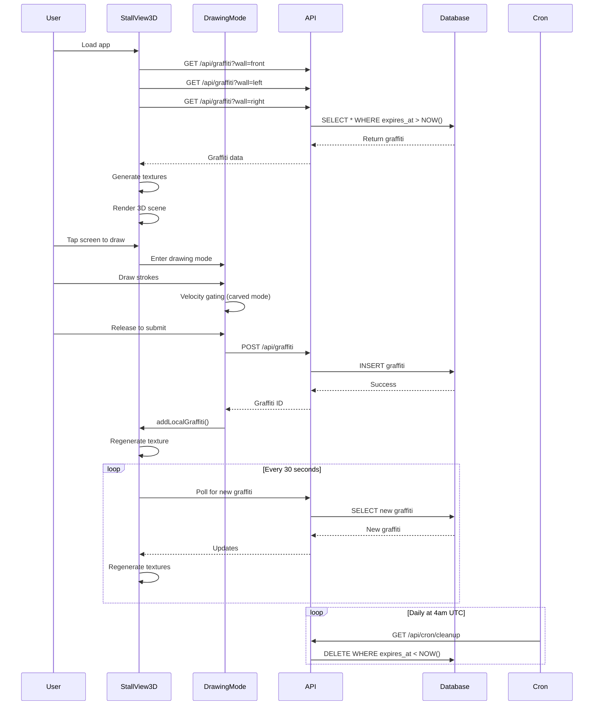
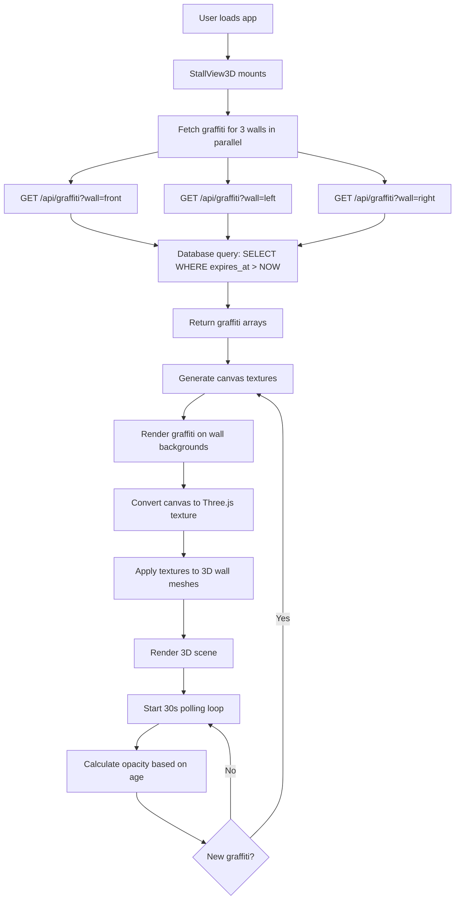
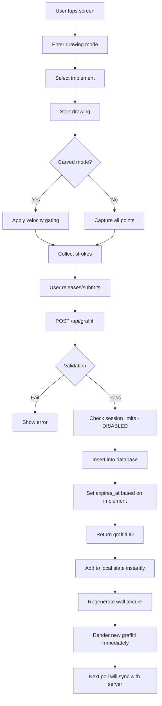
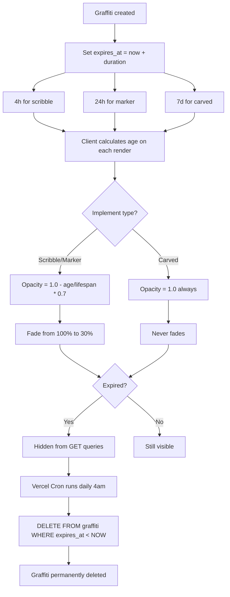
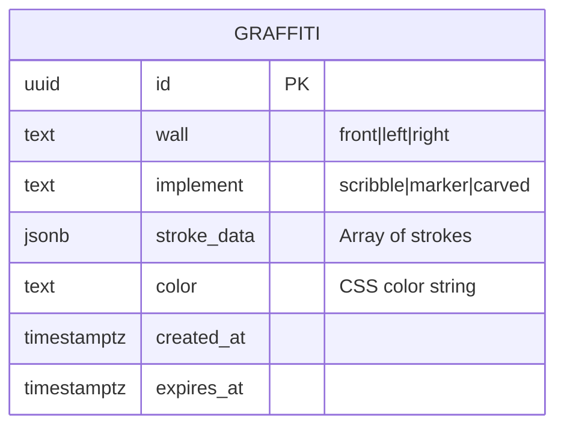

# Architecture Documentation

**Project:** Stall - Ephemeral Graffiti PWA
**Last Updated:** 2026-01-06
**Architecture Type:** Client-Heavy Serverless

---

## Table of Contents

1. [Overview](#overview)
2. [Architecture Diagram](#architecture-diagram)
3. [System Components](#system-components)
4. [Data Flow](#data-flow)
5. [Database Schema](#database-schema)
6. [Technology Stack](#technology-stack)
7. [Key Design Decisions](#key-design-decisions)
8. [Security & Abuse Prevention](#security--abuse-prevention)
9. [Known Issues & Technical Debt](#known-issues--technical-debt)
10. [Future Improvements](#future-improvements)

---

## Overview

**Stall** is an interactive 3D progressive web application that simulates a bathroom stall where users can leave ephemeral graffiti. The application combines WebGL 3D rendering with real-time canvas drawing to create an immersive, anonymous graffiti experience.

**Core Concept:** Users stand inside a virtual bathroom stall and can draw on three walls (front door, left partition, right partition) using different implements (scribble, marker, carved). Graffiti decays over time and eventually disappears.

**Target Platform:** Mobile-first, installable as PWA, works on desktop browsers.

---

## Architecture Diagram



### Component Interaction Flow



---

## System Components

### 1. Frontend Layer

#### StallView3D Component
**File:** [`components/StallView3D.tsx`](../components/StallView3D.tsx) (1141 lines)

**Responsibilities:**
- Three.js scene setup and management
- Camera positioning and rotation controls
- Canvas texture generation for walls, floor, ceiling
- Graffiti data fetching and polling
- Touch/mouse event handling for navigation
- Drawing mode state management
- Debug UI (optional)

**Key Features:**
- Uses React Three Fiber for declarative 3D rendering
- Implements smooth camera rotation with velocity damping
- Generates textures from Canvas 2D API
- Polls API every 30 seconds for new graffiti
- Calculates opacity based on graffiti age
- Supports touch gestures for mobile navigation

**Technical Implementation:**
```typescript
// Camera setup: positioned inside stall looking outward
<PerspectiveCamera
  makeDefault
  position={[0, 0.5, 0]}
  fov={90}
/>

// Wall textures generated from canvas
const frontTexture = useMemo(
  () => createDoorTexture(graffiti.front, 512, 512),
  [graffiti.front]
);
```

#### DrawingMode Component
**File:** [`components/DrawingMode.tsx`](../components/DrawingMode.tsx) (324 lines)

**Responsibilities:**
- Full-screen drawing overlay
- Touch/mouse event capture
- Stroke collection and validation
- Velocity-gated input (carved mode)
- Real-time stroke preview
- Graffiti submission

**Velocity Gating Logic:**
```typescript
// Carved mode requires slow, deliberate strokes
const velocity = distance / timeDelta;
if (velocity > CARVE_VELOCITY_THRESHOLD) {
  // Skip this point - stroke breaks naturally
  return;
}
```

#### Implement Picker
**File:** [`components/ImplementPicker.tsx`](../components/ImplementPicker.tsx)

Simple UI for selecting drawing tool (scribble/marker/carved).

---

### 2. API Layer

#### Graffiti CRUD
**File:** [`app/api/graffiti/route.ts`](../app/api/graffiti/route.ts)

**GET /api/graffiti?wall={wall}**
- Fetches all non-expired graffiti for specified wall
- Returns strokes, color, implement, timestamps
- Used by polling service and initial load

**POST /api/graffiti**
- Creates new graffiti entry
- Validates stroke data (max 100 strokes, 500 points per stroke)
- Checks session limits (currently disabled)
- Sets expiry based on implement type
- Returns created graffiti ID

**Validation Rules:**
```typescript
- Wall must be: 'front' | 'left' | 'right'
- Implement must be: 'scribble' | 'marker' | 'carved'
- Max 100 strokes per graffiti
- Max 500 points per stroke
- Coordinates must be 0-1 range
- Requires valid session ID
```

#### Admin Endpoints
**File:** [`app/api/graffiti/clear/route.ts`](../app/api/graffiti/clear/route.ts)

**POST /api/graffiti/clear**
- Deletes all graffiti from database
- Protected by secret token
- Used for testing/moderation

#### Cron Jobs
**File:** [`app/api/cron/cleanup/route.ts`](../app/api/cron/cleanup/route.ts)

**GET /api/cron/cleanup**
- Runs daily at 4am UTC (configured in vercel.json)
- Hard deletes expired graffiti
- Protected by Vercel cron secret

#### Database Initialization
**File:** [`app/api/init/route.ts`](../app/api/init/route.ts)

**GET /api/init**
- Creates database schema if not exists
- Idempotent (safe to run multiple times)
- Useful for deployment/testing

---

### 3. Data Access Layer

#### Database Module
**File:** [`lib/db.ts`](../lib/db.ts)

**Functions:**
- `getGraffitiByWall(wall)` - Fetch active graffiti
- `createGraffiti(data)` - Insert new graffiti
- `cleanupExpiredGraffiti()` - Delete old entries
- `clearAllGraffiti()` - Wipe database

**Connection:**
- Uses `@vercel/postgres` serverless client
- Connection pooling handled by Vercel
- Direct SQL queries (no ORM)

---

### 4. Session Management

**File:** [`lib/session.ts`](../lib/session.ts)

**Implementation:**
- Client-side only (no server-side tracking)
- Uses browser `sessionStorage` (tab-scoped)
- Generates UUID on first visit
- Tracks last activity timestamp
- Enforces post limit per session (disabled)

**Important Note:** `sessionStorage` is tab-scoped, not user-scoped. Opening a new tab creates a new session.

**Session Lifecycle:**
```typescript
// On app load
initializeSession() → generates UUID → stores in sessionStorage

// On draw submission
canUserPost() → checks last post time (disabled)
recordPost() → updates last post timestamp (disabled)

// Timeout check (disabled)
isSessionExpired() → 2-minute inactivity (disabled)
```

---

### 5. Feature Flags

**File:** [`lib/feature-flags.ts`](../lib/feature-flags.ts)

**Current State:**
```typescript
ENABLE_SESSION_TIMEOUT: false      // Session expires after 2min inactive
ENABLE_RATE_LIMITING: false        // IP-based rate limiting
ENABLE_SESSION_POST_LIMIT: false   // One post per session
```

**Status:** All abuse prevention features are currently disabled.

---

### 6. Configuration

**File:** [`lib/config.ts`](../lib/config.ts)

**Constants:**
- Graffiti durations (4h scribble, 1d marker, 7d carved)
- Wall dimensions and positions
- Implement styles (colors, line widths)
- Rate limiting thresholds
- Velocity gating values

---

## Data Flow

### Viewing Graffiti Flow



### Creating Graffiti Flow



### Decay & Cleanup Flow



---

## Database Schema



### Table: `graffiti`

| Column | Type | Description |
|--------|------|-------------|
| `id` | UUID | Primary key, auto-generated |
| `wall` | TEXT | Wall location: 'front', 'left', or 'right' |
| `implement` | TEXT | Drawing tool: 'scribble', 'marker', or 'carved' |
| `stroke_data` | JSONB | Array of strokes, each containing array of {x, y} coordinates (0-1 range) |
| `color` | TEXT | CSS color string (e.g., '#FF5733') |
| `created_at` | TIMESTAMPTZ | Timestamp when graffiti was created |
| `expires_at` | TIMESTAMPTZ | Timestamp when graffiti expires |

### Indexes

```sql
CREATE INDEX idx_graffiti_wall ON graffiti(wall);
CREATE INDEX idx_graffiti_expires ON graffiti(expires_at);
```

**Missing Index:** Composite index on `(wall, expires_at)` would optimize the primary query pattern.

### Stroke Data Format

```json
{
  "stroke_data": [
    [
      {"x": 0.234, "y": 0.567},
      {"x": 0.235, "y": 0.568},
      {"x": 0.237, "y": 0.570}
    ],
    [
      {"x": 0.456, "y": 0.789},
      {"x": 0.458, "y": 0.791}
    ]
  ]
}
```

Each graffiti contains multiple strokes. Each stroke is an array of coordinate objects. Coordinates are normalized ratios (0.0 to 1.0) relative to wall dimensions.

---

## Technology Stack

### Frontend

| Technology | Version | Purpose |
|------------|---------|---------|
| **Next.js** | 16.1.1 | React framework with App Router |
| **React** | 19.2.3 | UI library |
| **TypeScript** | 5.x | Type safety |
| **Three.js** | 0.182.0 | 3D rendering engine |
| **@react-three/fiber** | 9.5.0 | React renderer for Three.js |
| **@react-three/drei** | 10.7.7 | Three.js helpers and abstractions |
| **Tailwind CSS** | 4.x | Utility-first styling |

### Backend

| Technology | Version | Purpose |
|------------|---------|---------|
| **Vercel** | - | Hosting and serverless functions |
| **@vercel/postgres** | 0.10.0 | Serverless Postgres client |
| **uuid** | 13.0.0 | Session ID generation |

### Development

| Tool | Purpose |
|------|---------|
| **ESLint** | Code linting |
| **PostCSS** | CSS processing |
| **Vercel CLI** | Local development and deployment |

---

## Key Design Decisions

### 1. Client-Side Rendering Over SSR

**Decision:** All pages use `'use client'` directive, no server components.

**Rationale:**
- 3D rendering requires browser WebGL API
- Drawing interactions need client-side state
- Real-time polling and animations need client JS

**Trade-offs:**
- ✅ Smoother interactions, better UX for 3D/drawing
- ❌ Larger initial bundle size
- ❌ Slower time-to-interactive
- ❌ Can't leverage Next.js server component benefits

---

### 2. Coordinate System: Normalized Ratios (0-1)

**Decision:** Store all stroke coordinates as percentages (0.0 to 1.0) relative to wall dimensions.

**Example:**
```typescript
// Storage format
{x: 0.5, y: 0.75}  // Middle horizontally, 75% down vertically

// Rendering (wall is 512x512px)
const pixelX = 0.5 * 512;  // = 256px
const pixelY = 0.75 * 512; // = 384px
```

**Benefits:**
- Resolution-independent
- Works on any screen size
- Clean data format

**Complexity:**
- Requires coordinate transformation logic
- Side walls need X-axis flipping for correct perspective

---

### 3. Polling Over WebSockets

**Decision:** Use 30-second HTTP polling instead of WebSocket connections.

**Rationale:**
- Simpler implementation (no connection management)
- Fits serverless model better
- 30s delay acceptable for ephemeral graffiti (not live chat)
- Avoids WebSocket scaling costs

**Trade-offs:**
- ✅ Simpler code, easier to debug
- ✅ Works with Vercel serverless
- ❌ 30-second delay before seeing others' graffiti
- ❌ More HTTP requests than WebSocket
- ❌ Not real-time

---

### 4. Canvas-Based Texture Generation

**Decision:** Render graffiti onto HTML Canvas, then convert to Three.js texture.

**Alternative Approaches:**
- SVG overlays (not performant for complex strokes)
- WebGL shaders (much more complex)
- Three.js line geometries (harder to style)

**Chosen Approach:**
```typescript
const canvas = document.createElement('canvas');
const ctx = canvas.getContext('2d');
// Draw background
// Draw each graffiti stroke
// Convert to texture
const texture = new THREE.CanvasTexture(canvas);
```

**Benefits:**
- Pixel-perfect control
- Familiar Canvas 2D API
- Easy to add effects (blur, shadows, etc.)

**Performance Consideration:** Texture regenerates on every new graffiti. Could optimize with layered textures.

---

### 5. No Authentication or User Accounts

**Decision:** Completely anonymous system. No user accounts, no login.

**Rationale:**
- Matches bathroom graffiti metaphor (anonymous)
- Reduces friction (no signup barrier)
- Simplifies data model
- Protects user privacy

**Consequences:**
- ❌ No user history or favorites
- ❌ No moderation tools (can't ban users)
- ❌ Can't contact graffiti creators
- ❌ Hard to prevent abuse

---

### 6. Session = Browser Tab Instance

**Decision:** Use `sessionStorage` for session management.

**Important Behavior:**
- Each browser tab = separate session
- Closing and reopening tab = new session
- Private browsing = new session each time

**This is NOT:**
- User-scoped (multiple tabs = multiple sessions)
- Device-scoped
- Persistent across browser restarts

**Implication:** Current "one post per session" limit (when enabled) actually means "one post per tab opening."

---

### 7. Feature Flags for Abuse Prevention

**Decision:** Make all rate limiting and abuse prevention toggleable via feature flags.

**Current State:** All disabled (MVP mode)

```typescript
ENABLE_SESSION_TIMEOUT: false      // Users never time out
ENABLE_RATE_LIMITING: false        // No IP throttling
ENABLE_SESSION_POST_LIMIT: false   // Unlimited posts per session
```

**Intent:** Ability to enable protections when needed without code changes.

**Risk:** Currently running with zero active abuse prevention.

---

### 8. Hard Deletes Over Soft Deletes

**Decision:** Cron job permanently deletes expired graffiti.

```sql
DELETE FROM graffiti WHERE expires_at < NOW();
```

**Benefits:**
- Simpler query logic
- Smaller database size
- No "deleted" column needed

**Drawbacks:**
- ❌ Can't analyze retention patterns
- ❌ Can't restore accidentally deleted content
- ❌ No audit trail for abuse reports
- ❌ Lose valuable product analytics data

---

## Security & Abuse Prevention

### Currently Active Protections

✅ **Input Validation** (API level)
- Max 100 strokes per graffiti
- Max 500 points per stroke
- Coordinate bounds enforcement (0-1)
- Wall and implement enum validation
- Session ID required (though not verified)

✅ **Cron Secret Protection**
```typescript
if (request.headers.get('authorization') !== `Bearer ${process.env.CRON_SECRET}`) {
  return new Response('Unauthorized', { status: 401 });
}
```

✅ **Database Constraints**
- UUID primary keys (no predictable IDs)
- NOT NULL constraints on required fields

### Currently Disabled Protections

❌ **Session Post Limit** (Flag: `ENABLE_SESSION_POST_LIMIT`)
- One post per session
- Currently disabled → unlimited posts

❌ **IP-Based Rate Limiting** (Flag: `ENABLE_RATE_LIMITING`)
- 5 requests per hour per IP
- Currently disabled → unlimited requests
- **Critical Issue:** In-memory implementation doesn't work in serverless (see Known Issues)

❌ **Session Timeout** (Flag: `ENABLE_SESSION_TIMEOUT`)
- 2-minute inactivity timeout
- Currently disabled → sessions never expire

### Missing Protections

🚫 **No Content Moderation**
- No profanity filter
- No hate speech detection
- No NSFW detection
- No spam pattern recognition

🚫 **No User Banning**
- Can't block IP addresses
- Can't block session IDs
- No reporting mechanism

🚫 **No CAPTCHA or Proof-of-Work**
- Vulnerable to bot attacks
- No human verification

🚫 **No Duplicate Detection**
- Can't detect copied/reposted graffiti
- Stroke data is opaque JSONB

---

## Known Issues & Technical Debt

### Critical Issues

#### 1. **In-Memory Rate Limiting Broken in Serverless**
**File:** [`lib/rate-limit.ts`](../lib/rate-limit.ts)

**Problem:**
```typescript
// This Map resets on every cold start
const requestCounts = new Map<string, RequestInfo>();
```

In Vercel's serverless environment:
- Lambda functions are stateless
- Each cold start = empty rate limit map
- Multiple Lambda instances = separate rate limit maps
- Rate limiting is effectively non-functional

**Impact:** Even when enabled, rate limiting doesn't work.

**Fix Required:** Use distributed cache (Vercel KV, Upstash Redis, or similar).

---

#### 2. **Missing Composite Database Index**
**File:** [`lib/db.ts`](../lib/db.ts)

**Query Pattern:**
```sql
SELECT * FROM graffiti WHERE wall = ? AND expires_at > NOW()
```

**Current Indexes:**
```sql
CREATE INDEX idx_graffiti_wall ON graffiti(wall);
CREATE INDEX idx_graffiti_expires ON graffiti(expires_at);
```

**Problem:** Postgres uses one index, then filters in memory.

**Fix:**
```sql
CREATE INDEX idx_graffiti_wall_expires ON graffiti(wall, expires_at);
```

**Impact:** Query performance degrades with database growth (noticeable at 10K+ records).

---

#### 3. **Client-Side Opacity Calculation Causes Drift**
**File:** [`lib/wall-rendering.ts`](../lib/wall-rendering.ts:61-80)

**Problem:**
```typescript
// Opacity calculated once when graffiti loads
const age = now - createdAt;
const opacity = 1.0 - (age / lifespan) * 0.7;
```

**Behavior:**
- User A loads at 10:00am → sees 80% opacity
- User B loads at 10:30am → sees 60% opacity
- User A's view stays at 80% until new graffiti triggers re-render

**Issue:** Time-based state calculated once, not continuously updated.

**Fix Options:**
1. Recalculate in `requestAnimationFrame` loop (performance cost)
2. Server calculates and includes opacity in API response
3. Add `useEffect` timer to force periodic recalculation

---

### Major Issues

#### 4. **Stroke Data as JSONB Blocks Moderation**
**File:** [`lib/db.ts`](../lib/db.ts)

**Current Schema:**
```sql
stroke_data JSONB NOT NULL
```

**What You Can't Do:**
- Find graffiti overlapping specific coordinates
- Detect duplicate strokes (spam/copying)
- Build "clear area" admin tools
- Generate usage heatmaps
- Search by stroke patterns

**Future Pain:** When moderation is needed, you'll scan every JSONB blob in application code (very slow).

**Better Approach:**
```sql
CREATE TABLE strokes (
  graffiti_id UUID REFERENCES graffiti(id),
  stroke_index INT,
  points JSONB,
  bbox BOX  -- Enable spatial queries
);
```

---

#### 5. **1141-Line Monolithic Component**
**File:** [`components/StallView3D.tsx`](../components/StallView3D.tsx)

**Problems:**
- Impossible to unit test drawing logic
- Can't reuse texture generation elsewhere
- Coordinate transforms buried in event handlers
- Performance debugging is painful

**Recommended Refactor:**
- Extract texture generation → `lib/texture-generation.ts`
- Extract drawing state → `lib/drawing-state.ts`
- Extract coordinate transforms → `lib/coordinate-transforms.ts`
- Split component → `<StallScene>`, `<DrawingCanvas>`, `<NavigationControls>`

---

#### 6. **Hard Deletes Lose Product Data**
**File:** [`lib/db.ts`](../lib/db.ts) (cleanup function)

**Current:**
```sql
DELETE FROM graffiti WHERE expires_at < NOW();
```

**Data Lost:**
- Retention analysis (how long does graffiti actually last?)
- Popular walls/implements
- Abuse patterns
- Usage trends
- Ability to restore content

**Recommended:**
```sql
-- Soft delete
ALTER TABLE graffiti ADD COLUMN deleted_at TIMESTAMPTZ;
UPDATE graffiti SET deleted_at = NOW() WHERE expires_at < NOW();

-- Hard delete old soft-deletes monthly
DELETE FROM graffiti WHERE deleted_at < NOW() - INTERVAL '30 days';
```

---

### Minor Issues

#### 7. **All Feature Flags Disabled**

**Question:** Why write 400+ lines of rate limiting code if it's never enabled?

**Options:**
1. Enable `ENABLE_SESSION_POST_LIMIT` immediately
2. Delete all disabled code to reduce maintenance burden
3. Document why flags are disabled and when to enable

---

#### 8. **Session Scope Confusion**

`sessionStorage` is tab-scoped, not user-scoped. This means:
- Opening 2 tabs = 2 sessions = can post twice (when limit enabled)
- Closing tab = session lost
- Mobile app switching may kill session

**Fix:** Add clear documentation explaining this behavior.

---

## Future Improvements

### Short Term (Next Sprint)

1. **Add Composite Index**
   ```sql
   CREATE INDEX idx_graffiti_wall_expires ON graffiti(wall, expires_at);
   ```

2. **Enable Basic Abuse Prevention**
   ```typescript
   ENABLE_SESSION_POST_LIMIT: true  // At minimum
   ```

3. **Fix Opacity Drift**
   - Add server-side opacity calculation, or
   - Implement client-side continuous recalculation

4. **Document Session Behavior**
   - Add comments explaining `sessionStorage` scope

---

### Medium Term (1-2 Months)

1. **Replace Rate Limiter**
   - Implement with Vercel KV or Upstash Redis
   - Or remove entirely and rely on session limits

2. **Add Soft Deletes**
   - Preserve historical data for analytics
   - Enable restore functionality

3. **Extract Texture Generation**
   ```typescript
   // lib/texture-generation.ts
   export function createWallTexture(graffiti, width, height)
   export function createDoorTexture(graffiti, width, height)
   ```

4. **Add Basic Moderation**
   - Admin panel to view/delete graffiti
   - Report mechanism

---

### Long Term (3-6 Months)

1. **Refactor StallView3D**
   - Split into smaller, testable components
   - Extract business logic to hooks

2. **Improve Stroke Storage**
   - Add bounding boxes for spatial queries
   - Enable moderation by location

3. **Add Analytics**
   - Popular walls
   - Implement usage patterns
   - Retention metrics
   - User engagement

4. **Performance Optimization**
   - Layered texture composition (don't regenerate entire wall)
   - WebGL shader-based rendering
   - Texture compression

5. **Content Moderation**
   - Profanity filter
   - NSFW detection (ML model or API)
   - User reporting
   - Admin dashboard

---

## Deployment Architecture

### Vercel Configuration

**vercel.json:**
```json
{
  "crons": [{
    "path": "/api/cron/cleanup",
    "schedule": "0 4 * * *"
  }]
}
```

**Environment Variables Required:**
- `POSTGRES_URL` - Vercel Postgres connection string
- `CRON_SECRET` - Secret for cron job authentication
- `CLEAR_SECRET` - Secret for clear endpoint (optional)

**Build Configuration:**
- Framework: Next.js
- Build Command: `npm run build`
- Output Directory: `.next`
- Install Command: `npm install`

---

## Performance Considerations

### Texture Generation
- Regenerates entire wall texture on each new graffiti
- 512x512 canvas operations are relatively expensive
- Memoized with `useMemo` to avoid unnecessary regeneration

**Optimization Opportunity:** Use layered textures and only composite changes.

### Polling Frequency
- 30-second interval balances freshness vs. server load
- Could implement exponential backoff when no changes detected

### 3D Rendering
- 60fps target for smooth camera rotation
- Texture updates pause rendering briefly
- Debug mode impacts performance (disable in production)

### Database Queries
- Missing composite index will slow down as data grows
- Consider pagination if wall graffiti exceeds 100+ items

---

## Testing Strategy

**Current State:** No automated tests.

**Recommended Testing:**

**Unit Tests:**
- Coordinate transformation functions
- Velocity gating logic
- Opacity calculation
- Session management functions

**Integration Tests:**
- API endpoints (graffiti CRUD)
- Database queries
- Cron job cleanup

**End-to-End Tests:**
- Drawing and submission flow
- Multi-wall navigation
- Mobile touch gestures

**Visual Regression Tests:**
- Texture generation output
- 3D scene rendering

---

## Maintenance & Operations

### Daily Operations
- Monitor Vercel cron job success (cleanup runs 4am UTC)
- Check database size growth
- Monitor API error rates

### Weekly Review
- Analyze graffiti creation patterns
- Check for abuse/spam
- Review storage costs

### Monthly Tasks
- Review and archive old graffiti (if soft deletes added)
- Analyze popular walls/implements
- Update decay durations if needed

---

## Conclusion

**Stall** is a creative, well-executed concept with solid technical foundations. The 3D rendering and drawing mechanics work well. However, the application currently runs with zero active abuse prevention, which makes it vulnerable to spam at scale.

**Priority Actions:**
1. Enable session post limits immediately
2. Add composite database index
3. Fix or remove in-memory rate limiter
4. Document session behavior

**Long-term Success Factors:**
- Implement working abuse prevention
- Add content moderation tools
- Refactor monolithic component
- Preserve analytics data with soft deletes

The architecture is well-suited for the use case, but needs production-hardening before public launch.
